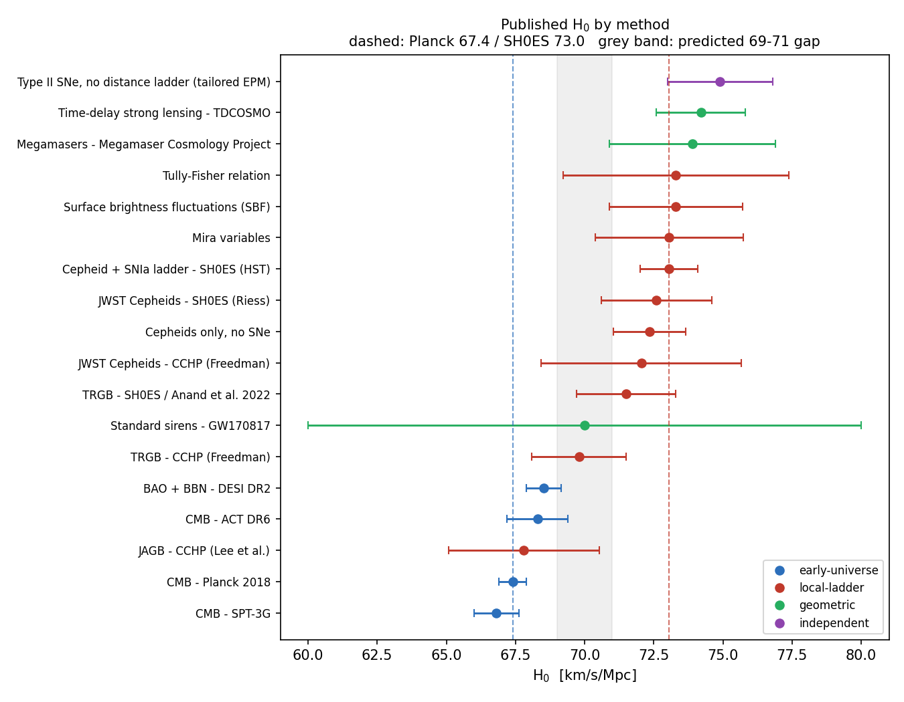
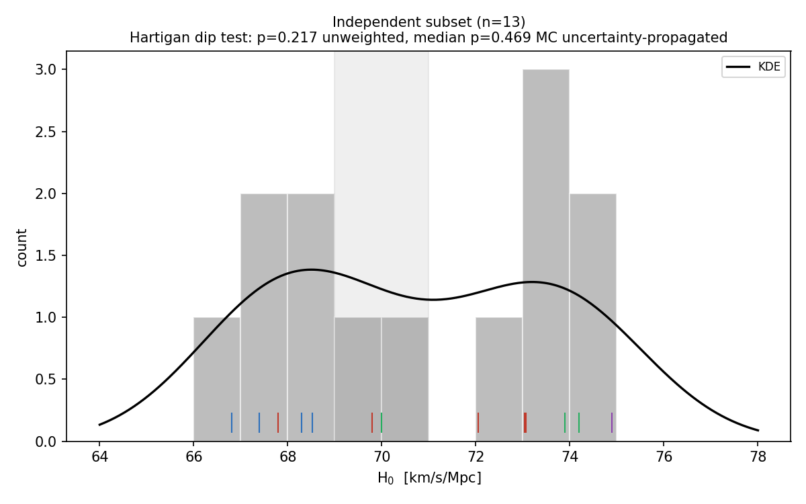
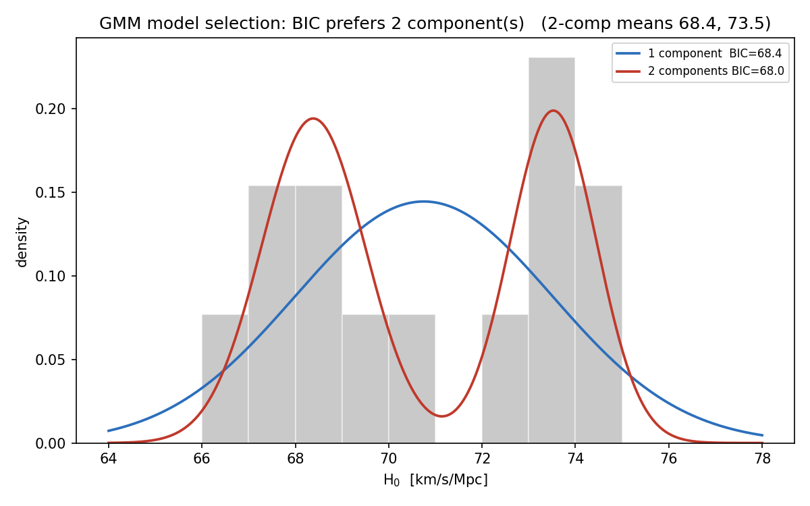

/ **[`main`](../../../README.md)** / **[`framework`](../../framework/)** / **[`working`](../)** / **[`cosmos`](../../cosmos/)** / **[`spectrum`](../../spectrum/)** /

---

# H₀ Bimodality: Discrete-vs-Continuous Test of the Section V Fork

**Status:** Analysis complete (2026-05-19). Exploratory, not pre-registered. The discrete two-cluster prediction is not supported; the Section V fork leans continuous.
**Dependencies:** Hubble-tension mechanism (Θ = 34/120 → 36/120 bosonic shift), the Section V discrete-vs-continuous prediction, the bosonic step 2/120.
**Related:** [hubble-tension.md](../../cosmos/files/hubble-tension.md), [sparc-phase-field.md](sparc-phase-field.md).

---

## The Question

The Hubble-tension note ([hubble-tension.md](../../cosmos/files/hubble-tension.md)) Section V states a discrete prediction: local H₀ should cluster at quantized values set by the lattice, not vary continuously between 67 and 73. The phase operator admits only the bare well ($\Theta_0 = 34/120$, H₀ ≈ 67) and the one-step shift ($\Theta = 36/120$, H₀ ≈ 73). Nothing in between.

This test asks one question: **do published H₀ measurements cluster into two discrete populations, or do they form a continuous spread?**

It is independent of the trigger mechanism. The SPARC test ([sparc-phase-field.md](sparc-phase-field.md)) falsified the specific coherence-scale trigger $L_f = v_c^2/a_0$. The trigger says *why* a shift would happen; the bimodality test asks *whether* the two-population structure exists at all. A discrete framework can survive a failed trigger; it cannot survive a continuous H₀ distribution.

This is a blind reanalysis of public data, not a pre-registered test. Every H₀ value used here was already published and widely known. The analysis choices (independent-subset membership, the statistical thresholds, the gap range) were fixed before the tests were run, but the data could not be blinded. The genuine forward test remains Euclid DR1.

---

## Result

**The discrete two-cluster prediction is not supported by current published H₀ data.**

The distribution is statistically consistent with a single continuous population. It does sort by calibration class (early-universe low, local-ladder high), but that stratification is the Hubble tension itself; it is not evidence of a discrete quantized step.

Three tests, run on a full 18-measurement set and a 13-row independent subset, with the model-dependent TDCOSMO value swapped between its two published determinations as a sensitivity check. All four configurations agree.

- **Hartigan dip test.** Fails to reject unimodality in every configuration. Primary config (independent subset, TDCOSMO = Shajib): p = 0.217 unweighted, median p = 0.469 with measurement uncertainties propagated by Monte Carlo, and only 5.3% of MC draws reach p < 0.05. No statistical signal of bimodality.
- **Gaussian mixture.** BIC does not cleanly separate 1- from 2-component fits: the independent subset weakly favours 2 components, the full set weakly favours 1, and every ΔBIC is far below the ≈ 2 threshold for even weak evidence. The models are effectively tied. Where a 2-component fit is the nominal pick, its means land near 68.4 and 73.5, not the lattice-predicted 67 and 73.
- **Gap test.** The predicted 69 to 71 gap is not empty. TRGB / CCHP (Freedman) at 69.8 ± 1.7 falls inside it, and JAGB / CCHP at 67.8 blurs the low edge.

By the Section V kill table, a failure to reject unimodality is evidence against the quantized-step picture.

---

## I. Data

Eighteen published H₀ determinations, one row per independent analysis, compiled 2026-05-19 from the primary literature. Units km/s/Mpc. The "Indep." column marks membership in the independent subset (Section II).

| Method | Class | H₀ | σ | Reference | Indep. |
|---|---|---|---|---|---|
| CMB, Planck 2018 | early-universe | 67.40 | 0.50 | Planck Collab. 2020 | Y |
| CMB, ACT DR6 | early-universe | 68.30 | 1.10 | Madhavacheril et al. 2024 | Y |
| CMB, SPT-3G | early-universe | 66.81 | 0.81 | SPT-3G / Camphuis 2025 | Y |
| BAO + BBN, DESI DR2 | early-universe | 68.52 | 0.62 | DESI Collab. 2025 | Y |
| Cepheid + SNIa, SH0ES (HST) | local-ladder | 73.04 | 1.04 | Riess et al. 2022 | Y |
| JWST Cepheids, CCHP | local-ladder | 72.05 | 3.62 | Freedman et al. 2025 | Y |
| JWST Cepheids, SH0ES | local-ladder | 72.60 | 2.00 | Riess et al. 2024 | N |
| TRGB, CCHP | local-ladder | 69.80 | 1.71 | Freedman et al. 2019/2021 | Y |
| TRGB, Anand 2022 | local-ladder | 71.50 | 1.80 | Anand et al. 2022 | N |
| JAGB, CCHP | local-ladder | 67.80 | 2.72 | Lee et al. 2024 | Y |
| Mira variables | local-ladder | 73.06 | 2.67 | cluster-Mira team 2025 | Y |
| Surface brightness fluctuations | local-ladder | 73.30 | 2.40 | Blakeslee et al. 2021 | N |
| Tully-Fisher relation | local-ladder | 73.30 | 4.08 | Boubel et al. 2024 | N |
| Megamasers, MCP | geometric | 73.90 | 3.00 | Pesce et al. 2020 | Y |
| Time-delay lensing, TDCOSMO | geometric | 74.20 | 1.60 | Shajib et al. 2023 | Y |
| Standard sirens, GW170817 | geometric | 70.00 | 10.00 | Abbott et al. 2017 | Y |
| Cepheids only, no SNe | local-ladder | 71.70 | 1.30 | Stiskalek et al. 2026 | N |
| Type II SNe, tailored EPM | independent | 74.90 | 1.90 | Vogl et al. 2025 | Y |

Notes on individual rows. The Stiskalek et al. 2026 value is the MNRAS abstract figure 71.7 ± 1.3, the result under the paper's main stated selection assumption. GW170817 has an asymmetric interval (+12/−8); a symmetric σ ≈ 10 is used as a placeholder. The TDCOSMO row is model-dependent: Shajib et al. 2023 (parametrized mass profiles) gives 74.2 ± 1.6, Birrer et al. 2020 (maximally flexible mass models) gives 67.4 ± 3.7. Both are carried as a sensitivity check.

---

## II. Method

### Independent subset

The 18 measurements are not 18 independent data points. Many share anchor galaxies, supernova samples, or calibration steps; correlated measurements inflate apparent bimodality. Five rows are tagged non-independent and excluded from the primary subset:

- **JWST Cepheids, SH0ES (Riess 2024)** is an explicit cross-check of Riess et al. 2022, same team, anchors, and supernova sample.
- **TRGB, Anand 2022** is a re-reduction of the same CCHP TRGB photometry with a different edge-detection method.
- **Cepheids only (Stiskalek 2026)** is a re-analysis of the SH0ES second-rung Cepheid data.
- **Surface brightness fluctuations** has a zero-point tied to the Cepheid scale; it inherits that calibration rather than measuring H₀ independently.
- **Tully-Fisher** has a zero-point calibrated on Cepheid and TRGB distances; same inheritance.

The 13-row independent subset is the primary set; the full 18-row set is reported as secondary. The four early-universe experiments are kept in but share sound-horizon physics, noted where relevant.

### Tests

1. **Hartigan dip test** for unimodality. Run unweighted on the central values, then in a Monte-Carlo variant: each iteration draws every measurement from $\mathcal{N}(H_0, \sigma^2)$ and runs the dip test on the pooled draw, so a wide measurement spreads its mass and contributes less to any apparent cluster (5000 draws). The dip test has no native weighting; this is the uncertainty-propagated equivalent.
2. **Gaussian mixture model**, 1 versus 2 components, compared by BIC.
3. **Gap test**: count of measurements in the predicted 69 to 71 gap, with GW170817 excluded because its σ ≈ 10 spans the whole range.

Each test is run on both sets and both TDCOSMO values.

---

## III. Findings

### By method

Every measurement with its error bar, sorted by H₀ and coloured by class. The early-universe cluster (66.8 to 68.5) is tight. The local side is a smear from 71.5 to 74.9 with no obvious sub-peak. Two local-ladder methods sit inside or next to the predicted gap (grey band): JAGB at 67.8 and TRGB / CCHP at 69.8.

### Dip test

| Configuration | dip p (unweighted) | median p (MC) | MC fraction p < 0.05 |
|---|---|---|---|
| Independent, TDCOSMO = Shajib (primary) | 0.217 | 0.469 | 5.3% |
| Full, TDCOSMO = Shajib | 0.722 | 0.606 | 2.3% |
| Independent, TDCOSMO = Birrer | 0.661 | 0.648 | 2.9% |
| Full, TDCOSMO = Birrer | 0.308 | 0.620 | 1.9% |

The null hypothesis is unimodal. It is not rejected anywhere.

The KDE shows a soft two-hump shape driven by the genuine class stratification, but the trough is too shallow for the dip test to flag.

### Gaussian mixture

BIC does not cleanly prefer two components. The independent subset weakly favours a 2-component fit (ΔBIC 0.47 with TDCOSMO = Shajib, 0.15 with Birrer); the full 18-row set weakly favours a single component (ΔBIC 0.73 and 0.30 the other way). Every margin is far below the ΔBIC ≈ 2 threshold for even weak evidence, so the 1- and 2-component models are statistically tied in all four configurations. Where a 2-component fit is the nominal pick (the independent subset), its means come out near 68.4 and 73.4 to 73.5: the low cluster is roughly one unit above the lattice value of 67.

### Gap test

One independent local-ladder method falls in the predicted 69 to 71 gap: TRGB / CCHP (Freedman) at 69.8 ± 1.7. JAGB / CCHP at 67.8 blurs the low edge. The gap is populated, not clean.

### Class means

Inverse-variance weighted: early-universe 67.7 (n = 4, range 66.8 to 68.5); local-ladder 71.9 to 72.0; geometric 74.0; Type II SNe EPM 74.9. The class stratification is real. The discrete quantization is not.

---

## IV. Reading against the Section V kill table

| Pre-stated outcome | Observed | Implication |
|---|---|---|
| Continuous spread 67 to 73 | Dip test cannot reject unimodality | Falsifies quantized step |
| Two clusters at wrong values (e.g. 68 and 72) | GMM, where it picks 2 components, gives 68.4 / 73.5 | Quantized step wrong size |
| TRGB or JAGB land near 70 | TRGB / CCHP at 69.8, in the gap | Intermediate state; single-step picture fails |
| Local methods near 73, early-universe near 67 | Holds: see class means | Method-class stratification present |

The first three rows all register against the discrete picture. The fourth holds, but method-class stratification is just the Hubble tension restated; it is not evidence of a discrete quantized step.

---

## V. Caveats

- **Low statistical power.** With 13 to 18 measurements the dip test has limited power. "No evidence for bimodality" is not the same as a strong falsification. By the Section V kill table a failure to reject unimodality counts as evidence against the quantized picture, and that is the standard applied here.
- **The soft two-hump shape is real** but too shallow for the dip test to flag and too weak for the GMM to distinguish from a single broad population.
- **TDCOSMO model choice does not matter.** Swapping Shajib 2023 (74.2) for Birrer 2020 (67.4) changes no verdict.
- **SH0ES per-host H₀ not used.** Per-host distance moduli would add ~37 points, all local-ladder class; they probe intra-sample scatter rather than the bimodality fork and would not change this verdict. Available as an extension.

---

## VI. Relation to the SPARC result

The two registered tests separate cleanly. SPARC ([sparc-phase-field.md](sparc-phase-field.md)) falsified the coherence-scale trigger $L_f = v_c^2/a_0$: the mechanism that would force ordinary disk galaxies to realize the phase shift. This test addresses the downstream observable: whether the shift, however triggered, leaves a discrete two-population fingerprint in H₀ data. It does not.

Both outcomes are negative for the testable phase-field predictions, and both leave the lattice arithmetic untouched. The 8.4% well sensitivity at $\Theta_0 = 34/120$ (hubble-tension.md Sections III and IV) is geometry, not a claim either test probes. What fails here is the empirical signature the discrete picture would produce: current H₀ data is consistent with a continuous distribution, sorted by calibration class but not quantized.

---

## References

- Planck Collaboration (2020). Planck 2018 results. VI. Cosmological parameters. A&A, 641, A6.
- Madhavacheril, M. S., et al. (2024). The Atacama Cosmology Telescope: DR6 Gravitational Lensing. ApJ, 962, 113.
- SPT-3G Collaboration / Camphuis, E., et al. (2025). SPT-3G D1 TT/TE/EE. arXiv:2506.20707.
- DESI Collaboration (2025). DESI DR2 Results II. Phys. Rev. D, 112, 083515.
- Riess, A. G., et al. (2022). A Comprehensive Measurement of the Local Value of the Hubble Constant. ApJ, 934, L7.
- Riess, A. G., et al. (2024). JWST Observations Reject Unrecognized Crowding of Cepheid Photometry. ApJ, 962, L17.
- Freedman, W. L., et al. (2025). Status Report on the Chicago-Carnegie Hubble Program. ApJ, 985, 203.
- Freedman, W. L., et al. (2021). Calibration of the TRGB. ApJ, 919, 16.
- Anand, G. S., et al. (2022). Comparing TRGB Distances. ApJ, 932, 15.
- Lee, A. J., et al. (2024). The JAGB Method. arXiv:2408.03474.
- Pesce, D. W., et al. (2020). The Megamaser Cosmology Project XIII. ApJ, 891, L1.
- Shajib, A. J., et al. (2023). TDCOSMO XII. A&A, 673, A9.
- Birrer, S., et al. (2020). TDCOSMO IV. A&A, 643, A165.
- Abbott, B. P., et al. (2017). A gravitational-wave standard siren measurement of the Hubble constant. Nature, 551, 85.
- Vogl, C., et al. (2025). No rungs attached: a tailored EPM measurement of H₀. A&A, 702, A41.
- Blakeslee, J. P., et al. (2021). SBF Distances. ApJ, 911, 65.
- Boubel, P., Colless, M., Said, K., et al. (2024). An improved Tully-Fisher estimate of H₀. MNRAS, 533, 1550.
- Stiskalek, R., et al. (2026). A 1.8 per cent measurement of H₀ from Cepheids alone. MNRAS, 546, staf2260.
- Shatto, B. (2026). Mode Identity Theory engine file. github.com/dmobius3/mode-identity-theory

---

/ **[`main`](../../../README.md)** / **[`framework`](../../framework/)** / **[`working`](../)** / **[`cosmos`](../../cosmos/)** / **[`spectrum`](../../spectrum/)** /
