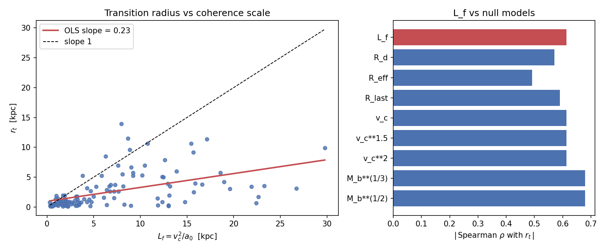
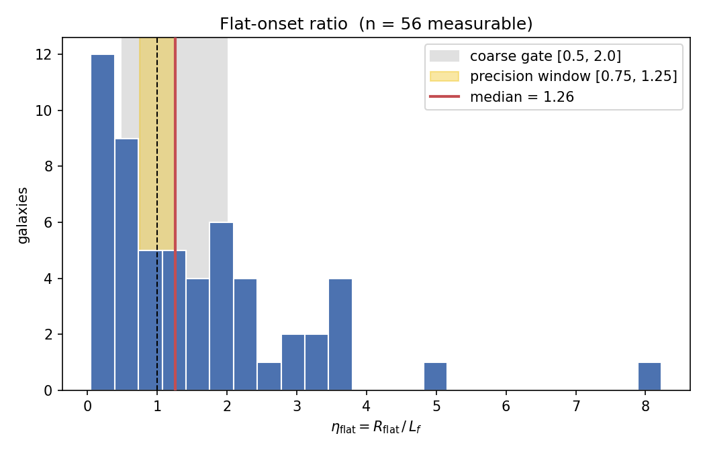

/ **[`main`](../../../README.md)** / **[`framework`](../../framework/)** / **[`working`](../)** / **[`cosmos`](../../cosmos/)** / **[`spectrum`](../../spectrum/)** /

---

# Phase Field Coherence Scale Predictions Across the SPARC Galaxy Sample

**Status:** Analysis complete (2026-05-19). The registered predictions are not borne out by SPARC; see the Result section. Pre-registration and pipeline: github.com/dmobius3/phase-field, tag `v1.0-preregistration`, DOI 10.5281/zenodo.20271702.
**Dependencies:** Hubble tension mechanism (Θ = 34/120 → 36/120 shift), MOND scale a₀ from scaling law C(13/120), closure identity T_c = 2ξ v_c²/c².
**Related:** [cone-point-coherence.md](cone-point-coherence.md), [h0-bimodality-test.md](h0-bimodality-test.md).

---

## The Question

Mode Identity Theory proposes a coherence scale $L_f = v_c^2/a_0$ inside which a binary phase field operates. This note registers one empirical question, narrow and falsifiable:

**Does $v_c^2/a_0$ behave like a real coherence radius across the SPARC sample of 175 galaxies, after controlling for ordinary galactic size scaling?**

Two SPARC-testable components, each separable from the other:

1. Do the gravitational transition radius $r_t$ and the flat-onset radius $R_\text{flat}$ track $L_f$, and more tightly than they track generic size proxies?
2. Does the phase-field trigger index, computed without kinematic pre-classification, predict which galaxies have flat versus rising rotation curves?

A third prediction, H₀ bimodality, is not testable with SPARC alone and is registered separately as forward-looking (§VIII).

The point of separating the tests is component-level falsification: failure isolates whether the binary threshold, the closure identity, or $L_f$ itself is the broken piece. The phase-field and Hubble-tension interpretation that motivates $L_f$ is given in §VI. It is the motivation for the coherence scale, not a result of this analysis. The SPARC test stands or falls on its own data.

---

## Result

The pre-registered pipeline was run once against SPARC on 2026-05-19. The pipeline, predictions, acceptance criteria, and sample cuts were frozen beforehand at tag `v1.0-preregistration` (github.com/dmobius3/phase-field, DOI 10.5281/zenodo.20271702).

**The registered predictions are not borne out.** Of 123 quality-filtered galaxies, the three testable predictions fail and the fourth is untestable on this sample.

| Prediction | Registered criterion | Observed | Verdict |
|---|---|---|---|
| 1. Transition radius tracks $L_f$ | $r_t$-vs-<i>L<sub>f</sub></i> OLS slope in [0.7, 1.3] | slope ≈ 0.23; $\eta_t$ median 0.38 | Fail |
| 2. Flat-onset radius tracks $L_f$ | $\eta_\text{flat}$ in precision window [0.75, 1.25] | median 1.26 (n = 56 measurable) | Fail (near-miss) |
| 3. Closure identity holds | ≤ 5% of flat-curve galaxies below $\mathcal{T}/\mathcal{T}_c = 1$ | 53.7% below | Fail |
| 4. Trigger index predicts morphology | AUC separating flat from rising curves | no rising-curve galaxies in the sample; AUC undefined | Untestable |

All verdicts are stable across the full 27-cell sensitivity grid (slope $r_t$ 0.18 to 0.30, slope $R_\text{flat}$ 0.11 to 0.33, predictions 1 to 4 unchanged in every cell): the failure is not an artifact of any analyst threshold.

- **Transition radius.** $r_t$ correlates with $L_f$ but with OLS slope ≈ 0.23, far below the registered [0.7, 1.3]. The ratio $\eta_t = r_t/L_f$ has median 0.38: the anomalous-acceleration transition occurs at roughly 40% of the predicted coherence radius, consistently.
- **Flat-onset radius.** $R_\text{flat}$ vs $L_f$ has slope ≈ 0.33; the ratio $\eta_\text{flat}$ has median 1.26 over the measurable sub-sample. Order unity, but the curve flattens beyond $L_f$, not at it.
- **Closure identity.** 53.7% of flat-curve galaxies fall below $\mathcal{T}/\mathcal{T}_c = 1$, against a registered tolerance of 5%. Universal threshold crossing fails.
- **Trigger index as predictor.** Untestable on this sample: the quality cuts leave no rising-curve galaxies, so there is no negative class. At stricter onset criteria roughly 27 of the 123 would be classed rising; the registered primary-cell labels leave none.



Left: $r_t$ against $L_f = v_c^2/a_0$ for the 123 galaxies, with the OLS slope of 0.23 against the slope-1 expectation. Right: $|\text{Spearman}\,\rho|$ of $r_t$ with $L_f$ and with each registered null model. $M_b^{1/3}$ and $M_b^{1/2}$ both correlate with $r_t$ more tightly than $L_f$ does.



The flat-onset ratio $\eta_\text{flat} = R_\text{flat}/L_f$ over the 56 measurable galaxies. The median 1.26 sits just outside the registered precision window [0.75, 1.25] (yellow), though inside the coarse gate [0.5, 2.0] (grey).

**Diagnosis.** The two radii fail in opposite directions: $r_t \approx 0.38\,L_f$ (transition too early), $R_\text{flat} \approx 1.26\,L_f$ (flatness onset too late). The single-<i>L<sub>f</sub></i> picture is too coarse: anomalous acceleration and kinematic flattening respond to different scales, with $L_f$ between them. A post-hoc null-model check finds $r_t$ tracks the baryonic mass distribution more tightly than $L_f$, and this holds across the plausible disk mass-to-light range: the transition radius is set by baryonic mass, not by $v_c^2/a_0$. The closure failure has a clear cause: for most SPARC galaxies $L_f = v_c^2/a_0$ reaches into the rising inner rotation curve where $v(r) \ll v_c$, so $\langle v^2 \rangle_{L_f}$ falls well below $v_c^2$. The flat-curve closure assumed $\langle v^2 \rangle = v_c^2$; real curves break that assumption substantially, not at the few-percent level the closure argument allowed.

### Robustness checks

Post-hoc checks, not part of the registered pipeline (`scripts/robustness.py` in the phase-field repo). They sharpen the diagnosis; they change no verdict.

The mass-to-light sweep recomputes $r_t$ at three disk $\Upsilon_\text{disk}$ values and asks whether $L_f$ ever out-predicts baryonic mass:

| $\Upsilon_\text{disk}$ | $r_t$-vs-<i>L<sub>f</sub></i> OLS slope | Spearman $\rho(r_t, L_f)$ | Spearman $\rho(r_t, M_b)$ | $L_f$ beats $M_b$? |
|---|---|---|---|---|
| 0.3 | 0.16 | 0.53 | 0.58 | No |
| 0.5 | 0.23 | 0.61 | 0.68 | No |
| 0.7 | 0.44 | 0.61 | 0.70 | No |

At every plausible mass-to-light ratio, $r_t$ correlates with baryonic mass more tightly than with $L_f$: the baryonic-mass dependence is real, not a mass-to-light artifact, and no value lifts the slope into the registered window. ($\Upsilon_\text{disk} = 0.7$ moves two galaxies off the flat-curve class, n = 121.)

- **Coverage.** 97.6% of galaxies have $L_f$ inside the measured rotation curve (median $R_\text{last}/L_f \approx 4.3$): the closure failure is not an extrapolation artifact.
- **Label stability.** Across the 9-cell (tolerance, persistence) grid, 27 of 123 galaxies flip flat/rising, but all 27 are flat at the primary cell and none is rising in every cell.

Component-level (§V): $L_f = v_c^2/a_0$ does not behave as the galactic coherence radius the framework posited, and the closure identity does not hold. This is a pre-registered negative result: a locked pipeline, archived with a DOI, run once. The genuine forward test against unseen data remains Euclid DR1 (§VIII).

---

*The sections below preserve the registered theoretical motivation and analysis protocol. They are retained for auditability; statements of prediction should be read as the tested hypotheses, not as conclusions.*

---

## I. The Coherence Scale and the Trigger

The phase field is active within a coherence scale:

$$L_f = \frac{v_c^2}{a_0}$$

where $a_0 = a_0(z{=}0) \approx 1.2 \times 10^{-10}$ m/s² is the local edge-mode value. The acceleration scale evolves with epoch ($a_0(z) = a_0(0) \times H(z)/H_0$), but all SPARC galaxies are at $z \approx 0$, so the local value applies throughout this analysis.

For the Milky Way ($v_c \approx 220$ km/s): $L_f \approx 13$ kpc.

The phase field activates when the trigger index exceeds a critical threshold:

$$\mathcal{T} \equiv \frac{2}{c^2 L_f} \int_0^{L_f} \Phi_\text{rel}(l)\, dl, \qquad \mathcal{T}_c = \frac{2\xi\, v_c^2}{c^2}$$

Geometry factor $\xi \approx 0.46$ (insensitive to halo profile: isothermal/NFW/Hernquist give 0.44–0.47).

For flat-rotation-curve galaxies: $\mathcal{T}/\mathcal{T}_c = 1/\xi \approx 2.2$. The threshold is always crossed. The phase field is always active. The response is binary:

$$\Theta_f = \frac{2}{120} \cdot \mathbf{1}(\mathcal{T} \geq \mathcal{T}_c)$$

One bosonic grid step or nothing. No continuous tuning.

### Open: discrete snap derivation

The binary response is declared and testable, but the mechanism that enforces quantization is not derived. Why does the phase field lock to exactly one bosonic grid step (2/120) rather than sliding continuously with potential depth? The 120-domain structure discretizes the available positions, but the selection rule that permits only a single-step jump (and forbids multi-step or fractional shifts) has no first-principles derivation. This is the gap between "the grid exists" and "the grid enforces a step function." Resolution likely requires the 120-domain selection rules; connection to the cone point analysis ([cone point coherence notes](cone-point-coherence.md)) is possible but speculative.

### Closure identity

$a_0$ cancels in the threshold:

$$\mathcal{T}_c = \frac{2\xi\, a_0\, L_f}{c^2} = \frac{2\xi\, v_c^2}{c^2}$$

The MOND scale sets the coherence radius but drops out of the threshold condition. Any galaxy with a flat rotation curve crosses the threshold regardless of mass, size, or luminosity.

---

## II. Data: The SPARC Sample

SPARC (Spitzer Photometry and Accurate Rotation Curves): Lelli, McGaugh, Schombert (2016).

- 175 galaxies
- Measured rotation curves from HI/Hα observations
- Spitzer 3.6μm photometry for stellar mass
- Well-characterized $v_c$ (flat rotation velocity)
- Publicly available: astroweb.cwru.edu/SPARC

### Per-galaxy parameters used

| Parameter | Source | Use |
|---|---|---|
| $v_c$ (flat) | Rotation curve outer region | Compute $L_f$ |
| $R_\text{last}$ | Last measured point on rotation curve | Compare to $L_f$ |
| Quality flag | SPARC catalog | Filter sample |
| Hubble type | SPARC catalog | Check for systematics |
| Distance | SPARC catalog | Anchor measurements |
| Inclination | SPARC catalog | Rotation curve reliability |

### Sample selection

- Include: galaxies with well-defined flat rotation region (quality flag 1 or 2).
- Exclude: galaxies with rising or falling rotation curves at the last measured point.
- Exclude: face-on galaxies with poorly constrained $v_c$ (inclination < 30°).

Expected usable sample: ~120–140 galaxies.

---

## III. Predictions

### Predicted L_f range across galaxy types

Using $a_0 = 1.2 \times 10^{-10}$ m/s²:

| Galaxy type | Typical $v_c$ (km/s) | Predicted $L_f$ (kpc) |
|---|---|---|
| Massive spiral | 250–300 | 17–24 |
| Milky Way-class | 200–230 | 11–14 |
| Low-mass spiral | 100–150 | 3–6 |
| Dwarf irregular | 30–70 | 0.2–1.3 |

### Transition radius tracks L_f

The radius at which gravitational behavior transitions from Newtonian to "anomalous" should correlate with $L_f = v_c^2/a_0$. For each SPARC galaxy, identify $r_t$ as the baryon-to-total divergence radius defined operationally in §IV ($g_\text{obs}/g_\text{bar} \geq 1.2$). Plot $r_t$ against $L_f$. Prediction: linear correlation with slope ≈ 1.

$r_t$ must **not** be defined as the radius where $g_\text{obs}$ crosses $a_0$. For a flat rotation curve $g_\text{obs}(r) = v_c^2/r$, so that radius is $v_c^2/a_0 = L_f$ identically: the correlation would be an arithmetic identity, not a physical result. The $g_\text{obs}/g_\text{bar}$ definition depends on the baryonic mass model, which $a_0$ does not enter, so a correlation with $L_f$ is a genuine empirical claim.

### Flat-curve onset radius tracks L_f

A second observable independent of $r_t$: define $R_\text{flat}$ as the radius where the rotation curve first reaches its flat value (operational form in §IV). Plot $R_\text{flat}$ against $L_f$ for each galaxy. Prediction: linear correlation with slope ≈ 1 in physical units (kpc vs kpc), intercept consistent with zero.

**The bare correlation is not sufficient evidence.** $L_f \propto v_c^2$, and any galactic radius grows with $v_c$, so $R_\text{flat}$ and $L_f$ will correlate even with no phase field, through shared mass scaling alone. The test must show that $R_\text{flat}$ tracks $L_f = v_c^2/a_0$ specifically: better than it tracks a null size proxy (optical scale length, $R_\text{last}$, or $v_c^1$), via partial correlation. A correlation that does not survive this control is "large galaxies are large," not a confirmation of the coherence scale.

The two correlations probe different physics. $r_t$ marks the onset of anomalous acceleration; $R_\text{flat}$ marks the onset of curve flatness. These are not the same radius in every galaxy. Agreement of both with $L_f$ is a stronger test than either alone.

### Primary registered outcome: dimensionless ratios

The correlations above are necessary but not sufficient. The primary pre-registered outcome is stated as two dimensionless ratios:

$$\eta_t = \frac{r_t}{L_f}, \qquad \eta_\text{flat} = \frac{R_\text{flat}}{L_f}$$

Prediction: across the quality-filtered sample, $\eta_t$ and $\eta_\text{flat}$ cluster around order unity with bounded scatter, rather than scattering freely or clustering at a value far from 1. A ratio near unity is the quantitative claim that the velocity-to-length conversion constant is $1/a_0$ specifically. A correlation alone leaves the constant free; the ratio fixes it.

The acceptance scatter bound $\sigma_\text{pred}$ must be set before data contact, derived by propagating SPARC's measurement uncertainties on $v_c$ and on the rotation-curve points through the $r_t$ and $R_\text{flat}$ algorithms. It is part of the frozen pipeline (§IV). "Clustering near unity" without a pre-registered $\sigma_\text{pred}$ is not falsifiable; with it, the test passes only if observed scatter is consistent with measurement error and fails if the ratios scatter beyond it.

### Universal threshold crossing

Every galaxy with a flat rotation curve should satisfy $\mathcal{T}/\mathcal{T}_c \approx 1/\xi \approx 2.2$ regardless of mass or size. Compute $\mathcal{T}_c$ for each galaxy; verify $\mathcal{T}/\mathcal{T}_c > 1$ for all flat-curve galaxies.

**Caveat on what this test proves, and how to run it correctly.** For any galaxy already classified as flat-curve, $\mathcal{T}/\mathcal{T}_c = 1/\xi$ follows algebraically from the flat-curve assumption: among that sub-sample the prediction is true by construction, not by observation. Computing the trigger index from a curve already labeled flat makes the index a consequence of the morphology, not a test of it.

Run the test in the opposite direction. Compute $\mathcal{T}/\mathcal{T}_c$ for every galaxy from its rotation curve without any flat/rising pre-classification, then ask whether the trigger index *predicts* the kinematic taxonomy: do galaxies the index places above threshold turn out to be the flat-curve systems, and those below threshold the rising-curve systems, when morphology is classified independently? In that direction the trigger index is a predictor of kinematic morphology rather than a restatement of it. The discriminating power lives in the rising-curve dwarfs, marginal curves, low-surface-brightness systems, and noisy outer curves: the cases where the index and the morphology could disagree. The "universal threshold crossing" and "dwarfs without flat curves" tests are the same test, sharp only on this non-flat sub-population.

### Dwarf galaxies without flat curves

Galaxies with rising rotation curves (no flat region) may fail to cross the threshold and would be unphased, predicting no H₀ shift in their environment. Identify these galaxies in SPARC; check if their environmental H₀ measurements differ from disk galaxies.

---

## IV. Analysis Methods

### Computing L_f

For each galaxy with measured $v_c$:

```
a_0 = 1.2e-10  # m/s²
v_c = [from SPARC]  # m/s
L_f = v_c**2 / a_0  # meters, convert to kpc
```

### Identifying the transition radius

For each rotation curve, compute the observed centripetal acceleration:

$$g_\text{obs}(r) = \frac{v(r)^2}{r}$$

And the baryonic (Newtonian) acceleration from the mass model:

$$g_\text{bar}(r) = \frac{v_\text{bar}(r)^2}{r}$$

**Operational algorithm for $r_t$.** Define $r_t$ as the smallest radius such that $g_\text{obs}(r)/g_\text{bar}(r) \geq 1.2$ for all measured points at $r \geq r_t$. The 1.2 threshold ensures the crossing reflects systematic divergence rather than pointwise scatter from bumpy rotation curves. The same algorithm applies to every galaxy in the sample without per-galaxy adjustment. Galaxies where no such radius exists within the measured range are flagged and counted as a separate sub-population; they represent a sample-selection question, not a prediction failure.

### Identifying R_flat

Define $R_\text{flat}$ as the smallest radius such that $|v(r) - v_c|/v_c \leq 0.05$ for all measured points at $r \geq R_\text{flat}$, where $v_c$ is the flat-region velocity from the SPARC catalog. The 5% tolerance accounts for measurement scatter within the flat region. Apply uniformly to all galaxies.

### Correlation analysis

- Pearson/Spearman correlation between $r_t$ and $L_f$.
- Residual analysis: check if scatter correlates with distance, inclination, Hubble type, surface brightness, or metallicity.
- If scatter correlates with a non-MIT variable, the phase field mechanism is in trouble.

### Null models

A correlation between $r_t$ (or $R_\text{flat}$) and $L_f$ is not evidence on its own. $L_f = v_c^2/a_0$ is proportional to $v_c^2$, and every galactic radius grows with $v_c$, so some correlation is guaranteed by size scaling. The test is whether $L_f$ beats the full family of plausible alternatives. Pre-registered null models, fit with the same procedure as $L_f$:

- Pure size proxies: $R_d$ (disk scale length), $R_\text{eff}$ (effective radius), $R_\text{last}$ (last measured rotation-curve point).
- Velocity scalings: $v_c$, $v_c^{1.5}$, $v_c^2$.
- Mass scalings: $M_b^{1/3}$, $M_b^{1/2}$ (baryonic mass).

$v_c^2$ is the null model that must lose. Since $L_f \propto v_c^2$, a correlation with $L_f$ that is no tighter than the correlation with $v_c^2$ cannot distinguish "phase field coherence radius" from "larger galaxies are larger." The acceleration scale $a_0$ enters only through the proportionality constant: $L_f = v_c^2/a_0$ claims that constant is exactly $1/a_0$, not some other velocity-to-length conversion. That claim is tested by the dimensionless ratio (§III), not by the correlation.

### Threshold verification

```
T_c = 2 * xi * v_c**2 / c**2
T = T_c / xi  # for flat rotation curves
ratio = T / T_c  # predicted ≈ 2.2 for all flat-curve galaxies
```

Pre-registered acceptance: among quality-filtered flat-curve galaxies (quality flag 1 or 2, inclination ≥ 30°), no more than 5% may fall below $\mathcal{T}/\mathcal{T}_c = 1$. The 5% margin accounts for SPARC measurement scatter (inclination errors, asymmetric rotation curves, distance uncertainties propagating to $v_c$). If more than 5% fall below threshold, the closure identity fails.

### Binary vs. continuous

If local H₀ estimates exist for SPARC galaxies (or for galaxies in similar environments):
- Bin by inside/outside $L_f$.
- Test for bimodality vs. unimodal spread.
- KS test or Hartigan's dip test for bimodality.

### Analysis protocol and registration status

This is a locked-pipeline blind analysis of pre-existing data, and the writeup should say so plainly. SPARC has been public since 2016. Freezing the pipeline (the operational algorithms above, the 1.2 and 5% thresholds, the sample cuts) and depositing the tagged commit before the data is touched defends against one objection: that the algorithm thresholds were tuned to the data. It does not defend against the objection that the data was already visible. Those are different claims and should not be conflated.

The primary defense is therefore not a timestamp. It is that $L_f = v_c^2/a_0$ and the slope ≈ 1 predictions are parameter-free consequences of the MIT topology, fixed before any galaxy was examined: nothing in the pipeline is fitted. The deposit is the secondary defense, retiring the threshold-tuning objection. The genuine pre-registered test against unseen data is Euclid DR1, not SPARC. Keep the two distinct: SPARC is a blind reanalysis, Euclid is the pre-registration.

---

## V. Falsification at the Component Level

The key advantage of the test. If it fails, we know which piece broke:

| Failure mode | What broke | Implication |
|---|---|---|
| $r_t$ does not correlate with $L_f$ | $L_f = v_c^2/a_0$ is wrong | Phase field coherence scale is incorrect |
| Threshold not universally crossed | Closure identity fails | $\mathcal{T}_c$ formulation or $\xi$ value is wrong |
| Scatter correlates with metallicity or density | Environmental variable dominates | Phase field is not the primary mechanism |
| $r_t$ correlates with $L_f$ but with wrong slope | $a_0$ value or formula structure is off | Specific coefficient needs correction |
| $r_t$ and $R_\text{flat}$ both track $L_f$ but with different slopes | Single-<i>L<sub>f</sub></i> picture is too coarse | Coherence scale is real, but anomalous acceleration and kinematic flattening respond to different radii |

**Observed (2026-05-19).** The SPARC run realized three of the modes above: the threshold is not universally crossed (closure identity fails); $r_t$ correlates with $L_f$ but with slope far below 1; and $r_t$ and $R_\text{flat}$ track $L_f$ with different, both-too-shallow slopes. See the Result section. The component-level reading: $L_f$ is not the coherence radius, and the closure identity does not hold.

The H₀ binary-vs-continuous failure mode is not in this table because SPARC does not provide the data to test it. That failure mode is registered in §VIII for future per-galaxy H₀ datasets.

---

## VI. Motivation: The Hubble Tension as a Phase Field Effect

This section gives the theoretical motivation for the coherence scale $L_f$ tested above. It is context, not evidence: the SPARC analysis in §III–§V does not depend on any of it.

Two classes of H₀ measurement persistently disagree:

| Method | H₀ (km/s/Mpc) | Environment |
|---|---|---|
| CMB (Planck) | 67.4 ± 0.5 | Global; unphased |
| Local distance ladder (SH0ES) | 73.0 ± 1.0 | Inside disk galaxies; phased |

MIT resolves this as a phase-field effect. The standing wave $\Psi = \cos(t/2)$ on the temporal edge is sampled at Fibonacci wells on the 120-domain of $S^3/2I$. The H₀ well sits at $\Theta = 34/120$ with $C(34/120) = 1.208$. Inside a disk galaxy, the local gravitational potential shifts the sampling position by one bosonic step (2/120) to $\Theta = 36/120$ with $C(36/120) = 1.309$. The ratio:

$$\frac{C(36/120)}{C(34/120)} = \frac{1.309}{1.208} = 1.084$$

Predicted shift: 8.4%. Observed tension: 67.4 → 73.0 ≈ 8.3%. Agreement < 1%.

---

## VII. Relation to Existing Work

### McGaugh's Radial Acceleration Relation

McGaugh et al. (2016) established a tight correlation between observed and baryonic acceleration in galaxies (the RAR). If the phase field mechanism is correct, it should reproduce the RAR as a consequence: inside $L_f$, the shifted sampling position would mimic additional mass, producing the observed tight correlation between baryonic and observed acceleration. This reproduction is MOTIVATED but not yet derived from the phase field equations.

Key distinction: the RAR alone does not predict H₀ bimodality. MIT does. This is the additional prediction that separates the frameworks.

### MOND

Milgrom (1983) identified $a_0$ as a fundamental acceleration scale. MIT derives $a_0$ from the scaling law: $a_0/a_P = C(13/120) \times (\sqrt{\Omega_H})^{-1}$. The value is not fitted. The coincidence $a_0 \approx cH_0$ is explained: both are edge modes on the standing wave, and their ratio $C(13/120)/C(34/120) = 0.184$ is fixed by the topology.

The structural distinction: MOND modifies the force law. MIT keeps gravity inverse-square everywhere. The "missing mass" inside galaxies is a curvature conversion from the embedded Möbius surface through the Gauss equation 3/2 factor. Inside the coherence scale $L_f$, the shifted sampling position on the bosonic grid ($\Theta = 34/120 \to 36/120$) mimics additional mass while leaving the force law intact.

This distinction has an observational discriminant on cosmological scales. MOND requires deviations from inverse-square gravity at low accelerations; MIT predicts inverse-square is exact at all scales. Gallardo et al. (2026), using Atacama Cosmology Telescope CMB maps and an SDSS galaxy catalog, measured the gravitational force-law exponent from pairwise kinematic Sunyaev-Zel'dovich velocities over 30–230 Mpc halo-pair separations and found $n = 2.1 \pm 0.3$, consistent with inverse-square gravity and a poor fit for MOND (PRL 136, 151002).

This is external context, not evidence for MIT. It provides independent motivation for mechanisms that preserve inverse-square gravity on large scales, but the SPARC test in §III–§V does not depend on it and is neither strengthened nor weakened by it. If the SPARC analysis stands on its own data, the Gallardo result is a convergence; if it does not, no credibility has been staked on another group's paper. The point that the phase field reproduces the radial acceleration relation without modifying gravity belongs in the paper-level write-up as a stand-alone subsection, framed as a comparison of mechanisms rather than a verdict.

### ΛCDM + Dark Matter Particles

ΛCDM fits rotation curves by adding a dark matter halo. MIT fits them through the Gauss equation 3/2 curvature conversion from the embedded Möbius surface. Both reproduce the data. The discriminant is direct detection: MIT predicts permanent null. Every null result from LUX, XENON, PandaX, SuperCDMS, and future experiments is consistent with MIT and increasingly difficult for particle dark matter.

---

## VIII. Forward-Looking: H₀ Bimodality

H₀ measurements at the per-galaxy level should cluster in two populations (CMB-like or SH0ES-like), not form a continuous distribution correlated with $v_c$ or $L_f$. MIT predicts binary: inside $L_f$ = shifted, outside = unshifted. No intermediate values.

SPARC does not provide per-galaxy H₀ measurements. SH0ES gives one aggregate H₀ across multiple Cepheid hosts, not a per-galaxy distribution. Verifying this prediction requires per-host H₀ estimates from forthcoming JWST Cepheid programs, TRGB calibrators, or megamaser distances. Registered here as a prediction; verification awaits future data.

---

## IX. Analysis Status

Complete. The pre-registered pipeline was executed once against SPARC on 2026-05-19. The registered run output, the three figures, and the post-hoc robustness checks are in the phase-field repository (github.com/dmobius3/phase-field). The outcome is the Result section above. Of 175 galaxies, 123 passed the quality, inclination, and velocity cuts and entered the analysis.

---

## X. Connection to MIT Framework

This paper tests one specific component of Mode Identity Theory: the phase field mechanism that resolves the Hubble tension. It does not require the full framework to be accepted. SPARC adjudicates three claims:

1. $L_f = v_c^2/a_0$ predicts a coherence scale for each galaxy.
2. The gravitational transition radius should track $L_f$ across the sample.
3. The trigger index should predict kinematic morphology, flat versus rising.

A fourth claim, that the H₀ shift is binary rather than continuous, is not testable with SPARC and is registered as forward-looking (§VIII).

If the three SPARC-testable claims hold across the sample, the phase field mechanism is supported independently of Euclid. If any fail, the specific failure mode tells you what to fix.

The geometric mechanism behind $L_f$ as a coherence scale is explored in the [cone point coherence notes](cone-point-coherence.md), which ask whether the $W$-independence of the Sector $\mathcal{A}$ eigenvalue (guaranteed by the cone point analysis on the Mobius band) nests to galactic scale. The SPARC test is empirical; the cone point analysis is structural. Both probe the same object ($L_f$) from different directions.

---

## References

- Lelli, F., McGaugh, S. S., Schombert, J. M. (2016). SPARC: Mass Models for 175 Disk Galaxies with Spitzer Photometry and Accurate Rotation Curves. AJ, 152, 157.
- McGaugh, S. S., Lelli, F., Schombert, J. M. (2016). The Radial Acceleration Relation in Rotationally Supported Galaxies. PRL, 117, 201101.
- Milgrom, M. (1983). A modification of the Newtonian dynamics as a possible alternative to the hidden mass hypothesis. ApJ, 270, 365.
- Gallardo, P. A., et al. (2026). Test of the Gravitational Force Law on Cosmological Scales Using the Kinematic Sunyaev-Zel'dovich Effect. PRL, 136, 151002. arXiv:2604.14327.
- Shatto, B. (2026). Mode Identity Theory engine file. github.com/dmobius3/mode-identity-theory

---

/ **[`main`](../../../README.md)** / **[`framework`](../../framework/)** / **[`working`](../)** / **[`cosmos`](../../cosmos/)** / **[`spectrum`](../../spectrum/)** /
